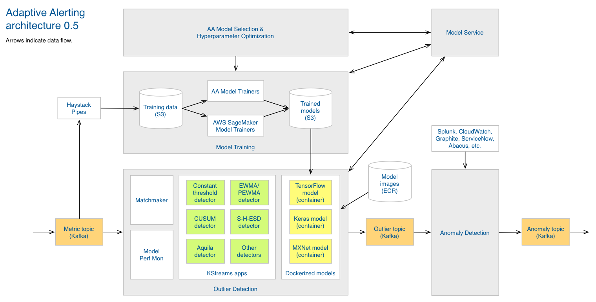

# Adaptive Alerting architecture

This page describes the Adaptive Alerting architecture in its current form. This
is a living document: no doubt the architecture will evolve as we develop a
deeper understanding of the domain.

Adaptive Alerting has five modules, which appear as larger gray boxes in the
diagram. Below I describe their role in the overall system.

## Outlier Detection

The _Outlier Detection_ module is the heart of the system. It accepts incoming
metric points and classifies them as normal, weak outliers or strong outliers.
This classification is an initial signal indicating a possible anomaly. Outliers
(whether weak or strong) feed into the anomaly detection module for further
analysis.

The emphasis for outlier detection is speed. Most incoming metric points are
normal, and we want to filter them out to avoid unnecessary processing, which
helps us scale the number of metrics we can process.

Within the outlier detection module, the primary abstraction is an outlier
detector. This is a component that accepts a metric point and classifies it in
the manner described above. Different outlier detectors use different approaches
to performing the classification. One kind of outlier detector is a constant
threshold detector, which simply checks to see whether the metric point exceeds
a fixed threshold. Other outlier detectors account for seasonalities and trends
in the data.

Simpler outlier detectors like constant threshold, EWMA or PEWMA generally don't
require offline training. But more complex ones often do. For example, neural
network detectors like LSTM involves offline training. To support these, you can
deploy Docker containers that know how to handle models of a given type. Your
detectors can use these models to perform outlier detection. The container pulls
trained models down from a model store, such as S3.

When a metric point comes in, we need to route it to the right detector type.
For instance, if a disk available metric comes in, we would probably want to
pass this to a constant threshold detector. If a sales-related metric point
arrives, we probably want that to go to a detector that's equipped to handle
seasonality and trend. This is where the _Matchmaker_ comes in. It inspects the
metric point and then routes it to the correct detector. (We may change the name
of this component.)

Finally, we need to ensure that models are producing good classifications. The
_Performance Monitor_ tracks the model fit using standard measures such as RMSE
or sMAPE. If the model fit is poor, the Performance Monitor can schedule a model
rebuild with the model training module, or else simply log the issue for further
remediation.

## Anomaly Detection

The _Anomaly Detection_ module is the second phase of the metric processing
pipeline. Its purpose is to decide for any given outlier whether that outlier
represents an anomaly (roughly, an interesting change to the underlying
data-generating process), and if so, whether the anomaly is weak or strong.

It may sound funny that an outlier can come in but not represent an anomaly.
This is both possible and common. Most data-generating processes involve some
level of noise, and random sampling itself introduces additional noise in the
form of [sampling error](https://en.wikipedia.org/wiki/Sampling_error). So the
boundary between noise and anomaly usually isn't crisp:

(Figure adapted from one in _Outlier Analysis_ by Charu C. Aggarwal.)

The emphasis for anomaly detection is on _correctness_. Specifically, we are
trying to avoid false positives. This is more computationally expensive than
outlier detection, which is why we divide the overall process into a faster
filtering process and a slower but more careful verification process.

The design of this module is TBD, but I envision some kind of provider-based
design where we have different strategies for deciding whether outliers
represent true anomalies, and then perhaps an aggregation layer on top to
create an ensemble-based approach. For example, we can imagine having
rules-based provider that makes certain Splunk queries depending on the metric
metric involved, and various ML-based providers (naive Bayes classifiers,
multiple logistic regression, neural network classifiers, etc.) to help decide
whether an outlier represents an anomaly.

We will also need to evaluate the anomaly detection classifications. We will
need some way to capture the "ground truth" around real anomalies, and then
assess the precision/recall of our models (i.e., the extent to which they
capture _all_ and _only_ anomalies).

## Model Training

Above we noted that some outlier detectors require offline training. The _Model
Training_ module is where we do this. We siphon data off of the metric topic
using Haystack Pipes and dump that into S3. Then we run model training
algorithms on the training data, generally at regular intervals to ensure that
models stay fresh. We store the trained models in S3 for use by the Outlier
Detector module.

Note AWS SageMaker in the diagram. This is just one example--the intent is that
we can use external ML platforms and frameworks (e.g., TensorFlow, MXNet, Keras)
to train models as well as using trainers that ship with Adaptive Alerting.

## Model Selection and Hyperparameter Optimization

One of the goals for Adaptive Alerting is to be able to scale up to managing
alerts for millions of metrics. To achieve this scale, we need an automatic way
to identify for any given metric the best (or at least a reasonable) model and
hyperparameters. The _Model Selection and Hyperparameter Optimization (MS/HPO)_
module is responsible for accomplishing this task.

As with the Anomaly Detection module, the design for this module is TBD. A
provider model might make sense here too. For example, there could be a
rule-based provider that selects a model based on tags on the metric point.

## Model Service

The _Model Service_ provides general-purpose data management services for the
other modules. It will contain for example metric-to-model mappings, model build
metadata, model evaluation results and so forth.
